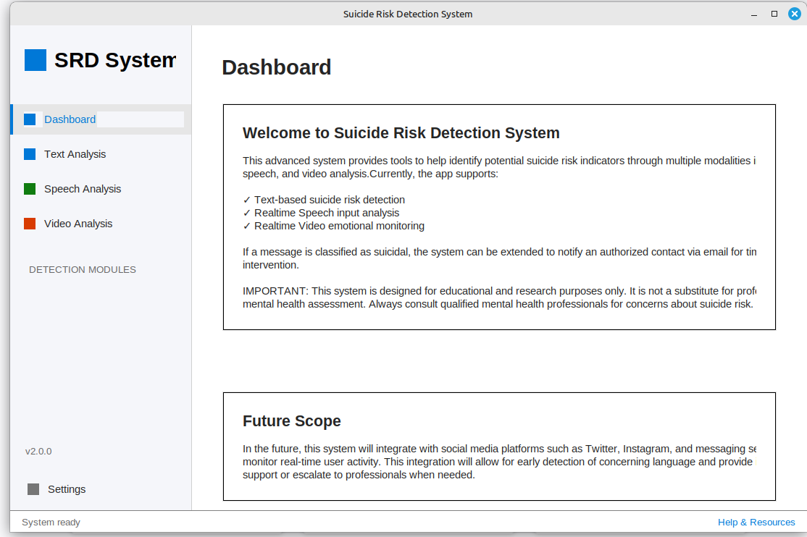

# 🛡️ S.A.V.E - Suicide Awareness & Voice-based Evaluation (Linux Version)

This project is designed for detecting potential suicidal behavior using emotion detection, speech analysis, and GUI-based interaction.

---

## 📁 Project Structure

Ensure your main script is located at:
```
~/Downloads/S.A.V.E(linux)/Suicide_Detection.py
```

---

## ⚙️ Setup Instructions

### ✅ 1. Create a Python Virtual Environment

Open your terminal and run:

```bash
python3 -m venv newenv
source newenv/bin/activate
```

You should see your prompt change to something like:
```
(newenv) adil@adil-Inspiron-5558:~$
```

### ✅ 2. Navigate to Your Project Directory

```bash
cd ~/Downloads/S.A.V.E\(linux\)/
```

### ✅ 3. Install Required Python Packages

Install all dependencies in the virtual environment:

```bash
pip install pillow sounddevice SpeechRecognition numpy matplotlib opencv-python requests
```

**Or** save the dependencies in a requirements file:

#### 📄 requirements.txt
```
pillow
sounddevice
SpeechRecognition
numpy
matplotlib
opencv-python
requests
```

Install from file using:
```bash
pip install -r requirements.txt
```

---

## 🚀 How to Run the Project

Run the main Python script with:

```bash
python Suicide_Detection.py
```

You can also open the project in VS Code (if installed):

```bash
code .
```

---

## 📦 Project Requirements

- **Python** 3.12 or above
- **Tkinter** (comes pre-installed with most Linux distributions)
- **Virtual environment** (recommended)

### Required Python packages:
- `pillow`
- `sounddevice`
- `SpeechRecognition`
- `numpy`
- `matplotlib`
- `opencv-python`
- `requests`

---

## 🎯 Features

- **Voice Analysis**: Real-time speech recognition and analysis
- **Emotion Detection**: Advanced emotion recognition capabilities
- **GUI Interface**: User-friendly graphical interface built with Tkinter
- **Cross-platform**: Optimized for Linux systems
- **Mental Health Support**: Designed to provide early intervention and support

---


## 🖼️ UI Screenshots

Here are a few visuals of the application interface:

### 🧭 Main Dashboard


### 🎤 Voice Analysis in Action



---


## 🔧 Troubleshooting

### Common Issues:

1. **Permission Denied for Audio Recording**:
   ```bash
   sudo usermod -a -G audio $USER
   ```
   Then logout and login again.

2. **Missing Audio Dependencies**:
   ```bash
   sudo apt-get install portaudio19-dev python3-pyaudio
   ```

3. **OpenCV Issues**:
   ```bash
   sudo apt-get install python3-opencv
   ```

---

## 📝 Usage Instructions

1. Activate your virtual environment
2. Navigate to the project directory
3. Run the main script
4. Follow the on-screen instructions
5. Speak clearly into your microphone when prompted
6. Review the analysis results

---

## ⚠️ Important Notes

- This tool is designed for educational and awareness purposes
- It should not replace professional mental health consultation
- Always seek professional help if you or someone you know is experiencing suicidal thoughts
- Emergency contacts: National Suicide Prevention Lifeline: 988 (US)

---

## 🤝 Contributing

Feel free to contribute to this project by:
- Reporting bugs
- Suggesting new features
- Submitting pull requests
- Improving documentation

---

## 📞 Emergency Resources

- **National Suicide Prevention Lifeline**: 988
- **Crisis Text Line**: Text HOME to 741741
- **International Association for Suicide Prevention**: https://www.iasp.info/resources/Crisis_Centres/

---

## 🙏 Credits

**Developed by**: Adil  
**Project Name**: S.A.V.E (linux)  
**Location**: `~/Downloads/S.A.V.E(linux)/`

---

## 📄 License

This project is developed for educational and awareness purposes. Please use responsibly and ethically.

---

*Remember: If you or someone you know is in immediate danger, please contact emergency services immediately.*
